# Trusted Completion Pipeline
**Version:** 1.0 | Phase 6.7 Milestone 4

## End-to-End Responsibility Completion Flow
This sequence diagram represents the full lifecycle of a responsibility completion event, demonstrating how LifeCircle OS ensures offline-first capability, idempotency, auditability, and eventually consistent cloud synchronization.

```mermaid
sequenceDiagram
    autonumber
    
    actor User as Family Member
    participant UI as ResponsibilitiesScreen
    participant Pipe as CompletionPipeline
    participant DB as Isar (Local DB)
    participant Sync as SyncService
    participant Cloud as LifeCircle Cloud
    
    User->>UI: Taps "Complete" (Haptic feedback)
    UI->>UI: Optimistic update (Immediate visual change)
    UI->>Pipe: markComplete(uuid, userId)
    
    rect rgb(20, 20, 30)
        Note over Pipe,DB: ATOMIC LOCAL TRANSACTION (< 16ms)
        Pipe->>DB: Read FamilyResponsibility
        alt is completed
            Pipe-->>UI: Throw AlreadyCompletedException
        end
        
        Pipe->>Pipe: Generate correlationId & idempotencyKey
        Pipe->>Pipe: Generate PeaceIndexAuditEntry
        Pipe->>Pipe: Generate SyncEvent (Outbox pattern)
        
        Pipe->>DB: writeTxn() { <br/> Update Responsibility <br/> Insert AuditEntry <br/> Insert SyncEvent <br/> }
        
        DB-->>UI: Return CompletionResult
    end
    
    rect rgb(10, 40, 20)
        Note over UI,DB: REACTIVE DOMAIN PROPAGATION
        DB-->>Pipe: watchLazy() triggers
        Pipe-->>UI: Stream updates Peace Score automatically
    end
    
    rect rgb(40, 20, 40)
        Note over Sync,Cloud: BACKGROUND CLOUD SYNC (Eventual Consistency)
        Sync->>DB: Read pendingUpload SyncEvents
        Sync->>Sync: Sign Payload (SEC-023)
        Sync->>Cloud: Push Event (idempotencyKey)
        
        alt Event accepted / Idempotent duplicate
            Cloud-->>Sync: ACK 200 OK
            Sync->>DB: Update SyncEvent state = processed
        else Network Error
            Cloud-->>Sync: Connection failed
            Note over Sync,DB: Remains in Outbox. Retries on next connection.
        end
    end
```

## Guarantees

1. **< 16ms Optimistic UI:** The user sees the result immediately, independent of network latency.
2. **Traceability:** The `correlationId` ties the local Audit Entry, Outbox Event, and Cloud transmission together.
3. **Idempotency:** The `idempotencyKey` prevents duplicate operations if a network failure causes the sync client to retry an already-received request.
4. **SEC-012 Privacy:** The payload sent to the cloud contains only category data and UUIDs, never PII (no medicine names or financial amounts).
