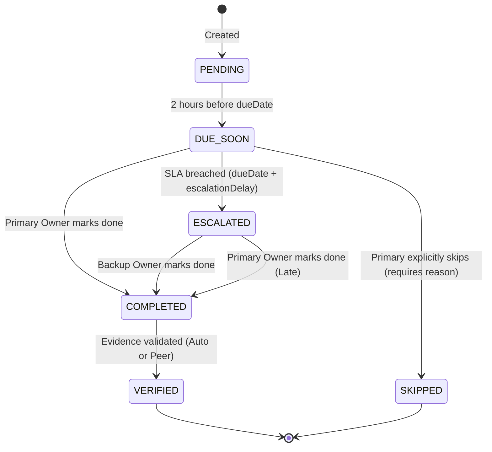

# Responsibility State Machine

This diagram defines the absolute state transitions allowed for a `FamilyResponsibility` entity.

## State Definitions
* **PENDING**: The default silent state. No notifications are fired. The system is trusting the primary owner.
* **DUE_SOON**: A gentle, local-only push notification to the `primaryOwner`. Still invisible to the `backupOwner`.
* **ESCALATED**: The "Exception-Based Alert". A high-priority notification is dispatched to the `backupOwner`. Trust is temporarily breached.
* **COMPLETED**: The task is marked done, pending evidence validation.
* **VERIFIED**: The task is fully closed. Confidence score is awarded.
* **SKIPPED**: The task was intentionally bypassed (e.g., "Doctor said skip medicine today"). Requires cryptographic log of the reason.
