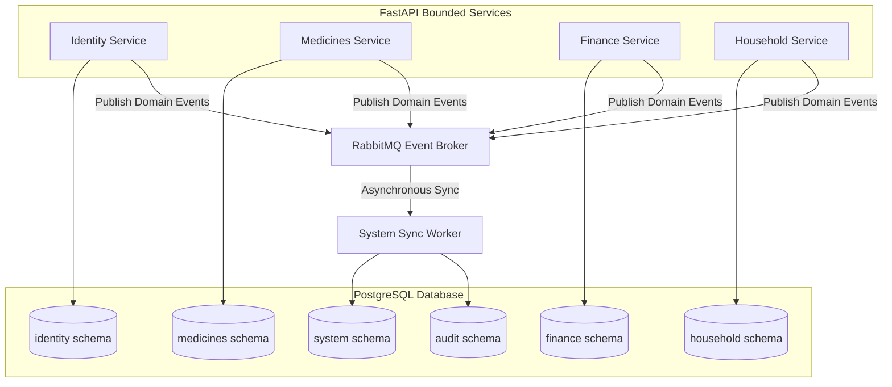

# LifeCircle OS — Database Architecture Specification

---

## Document Lifecycle
* **Status:** Locked (v1.0)
* **Owner:** Change Advisory Board (CAB) & Database Architect
* **Review Board:** Executive Architecture Board, Security & Privacy Board, Reliability & Platform Board, Quality Engineering Board, UX & Human Factors Board, Long-Term Governance Board
* **Last Review Date:** June 26, 2026
* **Next Review Date:** December 26, 2026

---

## Multi-Role Review Status

### Participating Roles
* **Chief Solution Architect:** APPROVED (Validates database schema partitions correctly isolate the DDD bounded contexts).
* **Enterprise Architect:** APPROVED (Validates schema modularity enables long-term scaling over a multi-decade horizon).
* **Principal Mobile Architect:** APPROVED (Confirms that server schemas and mobile Isar client schemas share consistent sync mapping entities).
* **Backend Architect:** APPROVED (Confirms backend integration leverages SQLAlchemy 2.0 Async ORM without leaking database models into domain layers).
* **Domain Architect:** APPROVED (Confirms domain structures remain pure, database representations are decoupled, and entities never commit transactions).
* **API Governance Architect:** APPROVED (Validates that API pagination parameters map directly to indexed database limits).
* **Integration Architect:** APPROVED (Validates that transactional outbox/inbox tables are configured to handle RabbitMQ broker events).
* **Security Architect:** APPROVED (Enforces granular schema-level access control, TLS 1.3, and column-level encryption keys).
* **Privacy Architect:** APPROVED (Enforces the PII Classification Matrix, ensuring column-level and app-layer encryption for confidential and restricted data).
* **Identity Architect:** APPROVED (Validates identity schemas, role mappings, session structures, and consent logs tables).
* **DevSecOps Architect:** APPROVED (Ensures Alembic migrations run securely in the automated CI/CD pipeline).
* **Cryptography Reviewer:** APPROVED (Confirms KMS-managed envelope encryption schemas and AES-256-GCM configurations).
* **Compliance Officer:** APPROVED (Validates data retention, right-to-be-forgotten deletion workflows, and consent registries support DPDP rules).
* **Observability Architect:** APPROVED (Confirms slow-query logging and connection pool metrics are exported via OpenTelemetry).
* **Site Reliability Architect (SRE):** APPROVED (Validates pgBouncer configurations, connection thresholds, and replication lag metrics).
* **Disaster Recovery Board:** APPROVED (Confirms PITR configurations, WAL continuous archiving, and RTO/RPO targets).
* **Platform Architect:** APPROVED (Ensures Redis and pgBouncer container topologies align with performance targets).
* **Infrastructure Architect:** APPROVED (Validates RDS and replication setups are provisioned declaratively via Terraform).
* **Release Governance Board:** APPROVED (Enforces zero-downtime Expand->Migrate->Contract migration patterns).
* **Chief QA Architect:** APPROVED (Validates test container database isolation and transaction rollback test fixtures).
* **Test Automation Architect:** APPROVED (Ensures transactional rollback structures are implemented for integration runs).
* **Performance Testing Architect:** APPROVED (Enforces query budgets (<100ms) and mandatory CI EXPLAIN ANALYZE checks).
* **Security Testing Board:** APPROVED (Validates that DB container checks run dynamic vulnerability analysis).
* **Mutation Testing Board:** APPROVED (Ensures testing suites check edge-case constraint violations like index uniqueness).
* **Contract Testing Board:** APPROVED (Confirms schema contract consistency against mock data structures).
* **Test Data Governance Board:** APPROVED (Ensures database seed data is generated using anonymized factories).
* **UX Guardian:** APPROVED WITH CONDITIONS (Ensures database query performance prevents screen rendering lags).
* **Design System Architect:** APPROVED WITH CONDITIONS (Validates that UI tokens storage is separate from domain schemas).
* **Elder Experience Specialist:** APPROVED WITH CONDITIONS (Validates that accessibility preferences are persisted per profile in the identity schema).
* **Localization Architect:** APPROVED (Confirms translation columns are designed for multi-lingual schema scaling).
* **Human Factors Reviewer:** APPROVED (Confirms database performance budgets support instant UI haptic feedback).
* **Legacy Governance Board:** APPROVED (Enforces strict snake_case naming conventions and rejects implicit magic behaviors).
* **Documentation Governance Board:** APPROVED (Validates dynamic database schema schema-to-markdown output generation).
* **Dependency Governance Board:** APPROVED (Validates SQLAlchemy and asyncpg driver dependencies versions).
* **Open Source Governance Board:** APPROVED (Confirms PostgreSQL open-source license compliance).
* **Financial Sustainability Board:** APPROVED (Confirms query performance optimizations prevent cloud infrastructure cost creep).
* **Change Advisory Board (CAB):** APPROVED (Validates the Database ADR policy and schema review procedures).

### Abstained Roles
* **Mobile Testing Architect:** ABSTAINED. Reason: Mobile UI and widget automated testing do not verify server database topology.
* **Accessibility Testing Board:** ABSTAINED. Reason: WCAG 2.2 AA accessibility screen-reader validations are client-side only.

---

## 1. Logical Schema Design & Bounded Contexts

To protect long-term data integrity and enforce Domain-Driven Design (DDD) boundaries:
* **PostgreSQL Schema Isolation (Option A):** All bounded contexts reside within a single PostgreSQL cluster, isolated into distinct logical schemas: `identity`, `medicines`, `finance`, `household`, `notifications`, `audit`, and `system`.
* **Zero Cross-Schema Operations:** Direct cross-schema database JOINs or writes inside the application services layer are strictly prohibited.
* **Communication Interface:** Cross-context operations must happen strictly via public APIs or asynchronous domain events published to RabbitMQ.
* **Database Role Permissions:** Database users/connections are restricted by role permissions:
  * The `medicines` application service connects using a role that has read/write privileges exclusively for the `medicines` schema.
  * Accessing tables in other schemas triggers a database-level authorization violation.

### Cross-Schema Dependency Policy
* Application services **SHALL NOT** perform direct SQL joins across bounded contexts.
* **Allowed Mechanisms:**
  * APIs (REST or gRPC client calls across contexts).
  * Domain Events (asynchronous sync via RabbitMQ).
  * Read Models (independent lookup tables populated by event handlers).
  * Materialized Views owned by reporting contexts.
* **Forbidden Mechanism:**
  * Direct cross-schema execution in code queries, e.g. `SELECT * FROM medicines JOIN finance ...`

### Database Ownership Matrix
To prevent orphaned tables and establish clear operational responsibility, each database schema is owned by a designated principal architecture role:

| Schema | Owner Role |
| :--- | :--- |
| **identity** | Identity Architect |
| **medicines** | Domain Architect |
| **finance** | Finance Domain Owner |
| **household** | Household Domain Owner |
| **notifications** | Integration Architect |
| **audit** | Compliance Officer |
| **system** | Platform Architect |

---

## 2. Database Naming Convention Standard

To maintain structure and prevent fragmentation over a 30-to-50-year horizon, all database entities must strictly adhere to the following naming standards:

| Entity Type | Convention | Examples |
| :--- | :--- | :--- |
| **Schemas** | `snake_case` (lowercase only) | `identity`, `medicines`, `finance` |
| **Tables** | `snake_case` (lowercase, plural) | `profiles`, `medicine_schedules`, `bills` |
| **Columns** | `snake_case` (lowercase, singular) | `id`, `medicine_name`, `created_at` |
| **Primary Keys** | `pk_<table>` | `pk_profiles`, `pk_medicine_schedules` |
| **Foreign Keys** | `fk_<table>_<columns>_<referenced_table>` | `fk_medicine_logs_schedule_id_medicine_schedules` |
| **Indexes** | `idx_<table>_<columns>` | `idx_bills_family_context_id`, `idx_bills_due_date` |
| **Unique Constraints**| `uq_<table>_<columns>` | `uq_profiles_email`, `uq_profiles_phone` |

---

## 3. PII Classification & Encryption Matrix

All table columns containing personally identifiable information (PII) or sensitive health/financial indicators must be classified and secured as defined below:

| Level | Description | Encryption Standard | Example Fields |
| :--- | :--- | :--- | :--- |
| **Public** | Reference metadata and configurations | None | Global drug indexes, chore categories |
| **Internal** | Generic operational variables | Standard storage-at-rest (AES-256) | Task descriptions, helper statuses |
| **Confidential**| Contact information and identifiers | Column-Level Encryption (AES-256-GCM) | Phone numbers, email addresses, names |
| **Restricted** | Sensitive health logs and financial values | App-Layer Encryption (AES-256-GCM Envelope) | Medicine logs, bill amounts, bank references |

*Note: Application-layer encryption utilizes Cloud KMS to fetch unique Data Encryption Keys (DEKs) wrapped by a Key Encryption Key (KEK). Encrypted fields are stored in `BYTEA` database columns.*

---

## 4. Core Data Models & Schema Table Definitions

### 4.1 identity Schema

#### Table: `identity.profiles`
Persistent profile record representing family members. Includes client-side dynamic accessibility settings.
* **Primary Key:** `pk_profiles` on `id` (UUID)
* **Columns:**
  * `id` `UUID` NOT NULL
  * `user_id` `UUID` NOT NULL
  * `first_name` `BYTEA` NOT NULL (Confidential classification)
  * `last_name` `BYTEA` NOT NULL (Confidential classification)
  * `email` `BYTEA` NOT NULL (Confidential classification)
  * `phone` `BYTEA` NOT NULL (Confidential classification)
  * `role_type` `VARCHAR(50)` NOT NULL (e.g., `'coordinator'`, `'co_pilot'`, `'elder'`, `'guest'`)
  * `is_elder_mode` `BOOLEAN` DEFAULT `FALSE` NOT NULL
  * `created_at` `TIMESTAMPTZ` DEFAULT `NOW()` NOT NULL
  * `updated_at` `TIMESTAMPTZ` DEFAULT `NOW()` NOT NULL
  * `deleted_at` `TIMESTAMPTZ` NULL
  * `deleted_by` `UUID` NULL
* **Unique Constraints:**
  * `uq_profiles_email` on `email`
  * `uq_profiles_phone` on `phone`
* **Indexes:**
  * `idx_profiles_role_type` on (`role_type`)
  * `idx_profiles_deleted_at` on (`deleted_at`) WHERE `deleted_at` IS NULL
* **Soft Delete Policy:** Enabled. Deleted columns must preserve `deleted_at` and `deleted_by`.
* **Retention Policy:** Permanent until account closure.

#### Table: `identity.consent_logs`
Immutable compliance record registering data consent logs.
* **Primary Key:** `pk_consent_logs` on `id` (UUID)
* **Columns:**
  * `id` `UUID` NOT NULL
  * `profile_id` `UUID` NOT NULL
  * `consent_type` `VARCHAR(100)` NOT NULL (e.g., `'data_sync'`, `'telemetry_opt_in'`)
  * `is_granted` `BOOLEAN` NOT NULL
  * `ip_address` `VARCHAR(45)` NOT NULL
  * `created_at` `TIMESTAMPTZ` DEFAULT `NOW()` NOT NULL
* **Foreign Key:** `fk_consent_logs_profile_id_profiles` on `profile_id` references `identity.profiles(id)`
* **Indexes:**
  * `idx_consent_logs_profile_id` on (`profile_id`)
* **Soft Delete Policy:** Disabled. Consent logs are legally immutable logs.
* **Retention Policy:** Permanent for audit durability.

---

### 4.2 medicines Schema

#### Table: `medicines.medicine_schedules`
Stores recurring schedules for family medical administrations.
* **Primary Key:** `pk_medicine_schedules` on `id` (UUID)
* **Columns:**
  * `id` `UUID` NOT NULL
  * `profile_id` `UUID` NOT NULL
  * `medicine_name` `VARCHAR(255)` NOT NULL
  * `dosage` `VARCHAR(100)` NOT NULL
  * `frequency_cron` `VARCHAR(100)` NOT NULL
  * `created_at` `TIMESTAMPTZ` DEFAULT `NOW()` NOT NULL
  * `updated_at` `TIMESTAMPTZ` DEFAULT `NOW()` NOT NULL
  * `deleted_at` `TIMESTAMPTZ` NULL
  * `deleted_by` `UUID` NULL
* **Indexes:**
  * `idx_medicine_schedules_profile_id` on (`profile_id`)
  * `idx_medicine_schedules_deleted_at` on (`deleted_at`) WHERE `deleted_at` IS NULL
* **Soft Delete Policy:** Enabled.
* **Retention Policy:** 10 years after schedule deactivation.

#### Table: `medicines.medicine_logs`
Chronological administration records.
* **Primary Key:** `pk_medicine_logs` on `id` (UUID)
* **Columns:**
  * `id` `UUID` NOT NULL
  * `schedule_id` `UUID` NOT NULL
  * `taken_by_profile_id` `UUID` NOT NULL
  * `status` `VARCHAR(50)` NOT NULL (e.g., `'taken'`, `'skipped'`, `'missed'`)
  * `taken_at` `TIMESTAMPTZ` NOT NULL (Restricted classification)
  * `created_at` `TIMESTAMPTZ` DEFAULT `NOW()` NOT NULL
* **Foreign Key:** `fk_medicine_logs_schedule_id_medicine_schedules` on `schedule_id` references `medicines.medicine_schedules(id)`
* **Indexes:**
  * `idx_medicine_logs_schedule_status` on (`schedule_id`, `status`)
  * `idx_medicine_logs_taken_at` on (`taken_at`)
* **Soft Delete Policy:** Disabled.
* **Retention Policy:** 5 years active, then compressed and moved to historical cold storage.

---

### 4.3 finance Schema

#### Table: `finance.bills`
Defines active household dues, EMIs, and utility schedules.
* **Primary Key:** `pk_bills` on `id` (UUID)
* **Columns:**
  * `id` `UUID` NOT NULL
  * `family_context_id` `UUID` NOT NULL
  * `biller_name` `VARCHAR(255)` NOT NULL
  * `amount` `BYTEA` NOT NULL (Restricted classification)
  * `due_date` `DATE` NOT NULL
  * `status` `VARCHAR(50)` NOT NULL (e.g., `'unpaid'`, `'paid'`, `'overdue'`)
  * `created_at` `TIMESTAMPTZ` DEFAULT `NOW()` NOT NULL
  * `updated_at` `TIMESTAMPTZ` DEFAULT `NOW()` NOT NULL
  * `deleted_at` `TIMESTAMPTZ` NULL
  * `deleted_by` `UUID` NULL
* **Indexes:**
  * `idx_bills_family_context_id` on (`family_context_id`)
  * `idx_bills_due_date` on (`due_date`)
  * `idx_bills_deleted_at` on (`deleted_at`) WHERE `deleted_at` IS NULL
* **Soft Delete Policy:** Enabled.
* **Retention Policy:** 7 years (Tax compliance rules).

#### Table: `finance.payments_ledger`
Append-only log of payments. Overwrites are physically blocked via database trigger rules.
* **Primary Key:** `pk_payments_ledger` on `id` (UUID)
* **Columns:**
  * `id` `UUID` NOT NULL
  * `bill_id` `UUID` NOT NULL
  * `paid_by_profile_id` `UUID` NOT NULL
  * `amount` `BYTEA` NOT NULL (Restricted classification)
  * `payment_method` `VARCHAR(100)` NOT NULL
  * `transaction_reference` `BYTEA` NOT NULL (Restricted classification)
  * `paid_at` `TIMESTAMPTZ` NOT NULL
  * `created_at` `TIMESTAMPTZ` DEFAULT `NOW()` NOT NULL
* **Foreign Key:** `fk_payments_ledger_bill_id_bills` on `bill_id` references `finance.bills(id)`
* **Unique Constraints:**
  * `uq_payments_ledger_transaction_reference` on (`transaction_reference`)
* **Indexes:**
  * `idx_payments_ledger_bill_id` on (`bill_id`)
  * `idx_payments_ledger_paid_at` on (`paid_at`)
* **Soft Delete Policy:** Disabled.
* **Retention Policy:** 10 years (Compliance audits).

---

### 4.4 household Schema

#### Table: `household.chores`
Daily house management tasks.
* **Primary Key:** `pk_chores` on `id` (UUID)
* **Columns:**
  * `id` `UUID` NOT NULL
  * `family_context_id` `UUID` NOT NULL
  * `title` `VARCHAR(255)` NOT NULL
  * `description` `TEXT` NULL
  * `assigned_profile_id` `UUID` NULL
  * `due_date` `DATE` NOT NULL
  * `status` `VARCHAR(50)` NOT NULL (e.g., `'pending'`, `'completed'`)
  * `created_at` `TIMESTAMPTZ` DEFAULT `NOW()` NOT NULL
  * `updated_at` `TIMESTAMPTZ` DEFAULT `NOW()` NOT NULL
  * `deleted_at` `TIMESTAMPTZ` NULL
  * `deleted_by` `UUID` NULL
* **Indexes:**
  * `idx_chores_family_context_id_status` on (`family_context_id`, `status`)
* **Soft Delete Policy:** Enabled.
* **Retention Policy:** 2 years active, then pruned.

#### Table: `household.helpers`
Registry of local service workers (maids, drivers, gardeners).
* **Primary Key:** `pk_helpers` on `id` (UUID)
* **Columns:**
  * `id` `UUID` NOT NULL
  * `family_context_id` `UUID` NOT NULL
  * `name` `BYTEA` NOT NULL (Confidential classification)
  * `role_type` `VARCHAR(100)` NOT NULL (e.g., `'maid'`, `'driver'`)
  * `phone` `BYTEA` NOT NULL (Confidential classification)
  * `is_active` `BOOLEAN` DEFAULT `TRUE` NOT NULL
  * `created_at` `TIMESTAMPTZ` DEFAULT `NOW()` NOT NULL
  * `updated_at` `TIMESTAMPTZ` DEFAULT `NOW()` NOT NULL
  * `deleted_at` `TIMESTAMPTZ` NULL
  * `deleted_by` `UUID` NULL
* **Indexes:**
  * `idx_helpers_family_context_id` on (`family_context_id`)
* **Soft Delete Policy:** Enabled.
* **Retention Policy:** Permanent.

#### Table: `household.helper_attendance`
Clock-in logs for local service helpers.
* **Primary Key:** `pk_helper_attendance` on `id` (UUID)
* **Columns:**
  * `id` `UUID` NOT NULL
  * `helper_id` `UUID` NOT NULL
  * `check_in` `TIMESTAMPTZ` NOT NULL
  * `check_out` `TIMESTAMPTZ` NULL
  * `created_at` `TIMESTAMPTZ` DEFAULT `NOW()` NOT NULL
* **Foreign Key:** `fk_helper_attendance_helper_id_helpers` on `helper_id` references `household.helpers(id)`
* **Indexes:**
  * `idx_helper_attendance_helper_check_in` on (`helper_id`, `check_in`)
* **Soft Delete Policy:** Disabled.
* **Retention Policy:** 3 years.

---

## 5. Audit, Event Storage & Data Lifecycle

To manage high volumes of log entries and system transactions without degrading operational table performance, logging tables are split into monthly range partitions. All timestamps must be written using `TIMESTAMPTZ` stored in UTC.

### Schema: `audit.audit_logs`
Chronicles all administrative mutations.
* **Composite Primary Key:** `pk_audit_logs` on (`id`, `created_at`)
* **Columns:**
  * `id` `UUID` NOT NULL
  * `audit_id` `UUID` NOT NULL
  * `correlation_id` `UUID` NOT NULL
  * `actor_id` `UUID` NOT NULL
  * `action` `VARCHAR(150)` NOT NULL
  * `target_entity` `VARCHAR(150)` NOT NULL
  * `target_entity_id` `UUID` NOT NULL
  * `pre_state` `JSONB` NULL
  * `post_state` `JSONB` NULL
  * `created_at` `TIMESTAMPTZ` NOT NULL
* **Partitioning:** Monthly range partitions on the `created_at` column.
* **Retention Policy:** 7 years. Old partitions are exported to WORM storage before eviction.

### Schema: `system.outbox_events`
Transactional outbox pattern table used to coordinate asynchronous worker synchronization.
* **Composite Primary Key:** `pk_outbox_events` on (`id`, `created_at`)
* **Columns:**
  * `id` `UUID` NOT NULL
  * `correlation_id` `UUID` NOT NULL
  * `aggregate_type` `VARCHAR(150)` NOT NULL
  * `aggregate_id` `UUID` NOT NULL
  * `event_type` `VARCHAR(150)` NOT NULL
  * `payload` `JSONB` NOT NULL
  * `status` `VARCHAR(50)` DEFAULT `'pending'` NOT NULL (e.g., `'pending'`, `'processed'`, `'failed'`)
  * `created_at` `TIMESTAMPTZ` NOT NULL
* **Partitioning:** Monthly range partitions on the `created_at` column.
* **Retention Policy:** 3 months (Purged automatically after delivery confirmation).

### Schema: `system.inbox_events`
Transactional inbox pattern table ensuring exactly-once processing (deduplication) of inbound messages.
* **Composite Primary Key:** `pk_inbox_events` on (`id`, `created_at`)
* **Columns:**
  * `id` `UUID` NOT NULL
  * `message_id` `UUID` NOT NULL
  * `correlation_id` `UUID` NOT NULL
  * `payload` `JSONB` NOT NULL
  * `status` `VARCHAR(50)` DEFAULT `'pending'` NOT NULL
  * `created_at` `TIMESTAMPTZ` NOT NULL
* **Unique Constraints:**
  * `uq_inbox_events_message_id` on (`message_id`, `created_at`)
* **Partitioning:** Monthly range partitions on the `created_at` column.
* **Retention Policy:** 3 months.

### Data Lifecycle Matrix
To prevent long-term storage bloat and satisfy regulatory compliance guidelines:

| Category | Retention | Delete Policy |
| :--- | :--- | :--- |
| **Audit Logs** | 7 years | Immutable (Direct deletion/updates blocked) |
| **Notification Logs** | 90 days | Automatic purge (Hard deletion) |
| **Medicine History** | User-controlled | Export + soft delete (Metadata anonymization option) |
| **Financial Records** | Configurable | Soft delete (Retained 7+ years for tax audit trails) |
| **Sessions** | 30 days | Hard delete (Automatic cache/database eviction) |

---

## 6. Database Migration Governance

To guarantee zero-downtime upgrades and eliminate manual manipulation risks:
* **Tooling Standard:** Alembic is the exclusive coordinator of database migrations. Manual SQL executions on production environments are strictly forbidden.
* **Forward-Only Migrations:** Downgrades are never run in production. All schema corrections are achieved by applying new forward-only migration scripts.
* **Mandatory Rollback Scripts:** Every Alembic script must include a fully validated and isolated rollback script maintained in Git for staging rollback testing.
* **Zero Destructive Migrations:** Columns or tables are never dropped during standard rollouts. If schema deprecations are necessary, they require Change Advisory Board (CAB) review and a formal Database ADR.

### Expand → Migrate → Contract Enforcement
All schema migrations must strictly implement the three-phase compatibility cycle:
1. **Expand:** Add new structures (e.g. nullable columns, new tables, or new indexes) without breaking the running database configuration.
2. **Migrate:** Dual-write to both legacy and new structures, while backfilling historical records asynchronously.
3. **Contract:** Remove legacy columns or tables only after verifying that all active application endpoints have ceased using the deprecated columns.
* *No destructive migrations (e.g., dropping columns or tables) are permitted to occur within a single release cycle.*

### Query Verification Gate (CI Pipeline)
The CI/CD pipeline runs `EXPLAIN ANALYZE` validations against a containerized PostgreSQL instance loaded with synthetic datasets exceeding **100,000 rows**. The validation gate blocks any PR if:
1. Any high-frequency application query results in a Sequential Scan (`Seq Scan`).
2. Any database read exceeds the strict P95 budget of **100 milliseconds**.

---

## 7. Performance & Resource Pooling Governance

To support backend response targets (P95 <300ms) and database query targets (<100ms):
* **Connection Pooling:** All database traffic is mediated by **pgBouncer** in transaction pooling mode.
* **Connection Configuration:**
  * Maximum active pool size: 100 connections.
  * Idle timeout: 30 seconds.
* **Explain Gate Compliance:**
  * Index configuration changes must be validated by a performance testing suite.
  * Indexes are designed as composite or partial indexes where possible to limit memory footprints.
* **Cache Eviction (Redis):** Short-lived tokens, sessions, and transaction rate-limit states are stored in Redis. Cache eviction protocols use Least Recently Used (LRU) algorithms.

---

## 8. Disaster Recovery & Availability Topology

Database operations must align with the disaster recovery goals specified in the platform constitutions:
* **Target SLOs:**
  * **RTO (Recovery Time Objective):** < 1 hour.
  * **RPO (Recovery Point Objective):** < 15 minutes.
* **High Availability Topology:**
  * Primary write node with asynchronous streaming replicas located in distinct availability zones (Multi-AZ).
  * Auto-failover triggered by platform health monitors when the primary node becomes unresponsive for >30 seconds.
* **Continuous Archiving:**
  * Write-Ahead Logs (WAL) are continuously archived (every 5 minutes or upon file closure) to geo-replicated, write-once-read-many (WORM) cloud object storage buckets.
* **Point-in-Time Recovery (PITR):**
  * Configured to reconstruct database states up to any timestamp within the past 30 days.
* **Verification Drills:**
  * Automated backup integrity checks run daily.
  * Staging environments must run quarterly recovery drills, restoring from WAL records to verify RTO and RPO limits.

---

## 9. Database ADR (Architecture Decision Record) Policy

Every significant modification of the database structure, schema, indexing rules, or migration processes requires a documented **Database ADR** inside the repository (`docs/adr/db/`).

Every Database ADR must contain:
1. **ADR Number & Title**
2. **Context & Motivation:** Why the database change is necessary.
3. **Alternatives Considered:** Technical alternatives and reasons for rejection.
4. **Migration Strategy:** The step-by-step Expand -> Migrate -> Contract rollout plan.
5. **Rollback Plan:** Actionable instructions to roll back changes if failure occurs.
6. **Performance Impact:** Resulting query execution plans and EXPLAIN measurements.
7. **Privacy Impact:** Data classification evaluation and KMS encryption configurations.

---

## 10. Institutional Principle

> **Core Philosophy:**  
> Databases represent the ultimate state of a family's history. Code changes hourly; data persists for generations. Treat the schema as an immutable constitution.

**Build once. Evolve forever.**

🙏 श्री गणेशाय नमः
