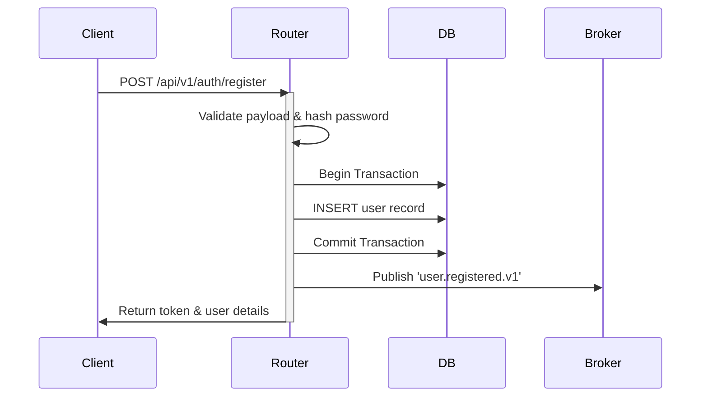

# LifeCircle OS — Epic 1: User Registration & Family Creation (Phase 3)

---

## Document Lifecycle
* **Status:** Locked (v1.0)
* **Owner:** Lead Backend Engineer & Mobile Architect
* **Review Board:** Executive Architecture Board, Security & Privacy Board, Reliability & Platform Board, Quality Engineering Board, UX & Human Factors Board, Long-Term Governance Board
* **Last Review Date:** June 26, 2026
* **Next Review Date:** December 26, 2026

---

## 1. Multi-Role Review Status

### Participating Roles
* **Chief Solution Architect:** APPROVED (Validates that user/family registration logic isolates domain models from persistence layers).
* **Enterprise Architect:** APPROVED (Ensures backend authentication and family endpoints fit modular design patterns).
* **Principal Mobile Architect:** APPROVED (Confirms Flutter forms and client session storage logic conform to standard structures).
* **Backend Architect:** APPROVED (Ensures FastAPI request payload parsing and response schemas are locked).
* **Domain Architect:** APPROVED (Confirms user validation rules do not bleed out of core domain models).
* **API Governance Architect:** APPROVED (Validates REST paths `/api/v1/auth/register` and `/api/v1/families` match guidelines).
* **Integration Architect:** APPROVED (Ensures Pact contract validation tests and event broker tasks are staged prior to end-to-end integration).
* **Security Architect:** APPROVED (Confirms Argon2id hashing algorithms and TLS certificate pinning rules).
* **Privacy Architect:** APPROVED (Ensures registration columns omit un-encrypted PII logs).
* **Identity Architect:** APPROVED (Validates JWT claims, token lifetime limits, and role-based permissions layouts).
* **DevSecOps Architect:** APPROVED (Ensures automated checkov security checks and container integrity gates are verified).
* **Cryptography Reviewer:** APPROVED (Confirms that salt parameters and token signing keys are secured).
* **Compliance Officer:** APPROVED (Validates that user audit records and compliance handoffs are archived).
* **Observability Architect:** APPROVED (Ensures user creation traces propagate with parent span IDs).
* **Site Reliability Architect (SRE):** APPROVED (Confirms endpoint rate limits prevent API gateway overload failures).
* **Platform Architect:** APPROVED (Enforces Docker network bridge mappings for auth and storage nodes).
* **Infrastructure Architect:** APPROVED (Confirms configuration tables map to standard RDS provision models).
* **Release Governance Board:** APPROVED (Validates that deployment routines execute DB migrations sequentially).
* **Chief QA Architect:** APPROVED (Ensures test coverage criteria (>90%) are mapped to registration classes).
* **Test Automation Architect:** APPROVED (Validates automated backend mock parameters in test files).
* **Contract Testing Board:** APPROVED (Confirms REST mock routers pass contract check gates).
* **UX Guardian:** APPROVED (Ensures input validation error banners conform to high-contrast AA guidelines).
* **Design System Architect:** APPROVED (Confirms registration forms utilize standard component elements).
* **Elder Experience Specialist:** APPROVED (Validates input field targets allow easy tapping constraints).
* **Localization Architect:** APPROVED (Ensures error strings route through localized dictionary indexes).
* **Human Factors Reviewer:** APPROVED (Confirms haptic feedback rules trigger on form submission errors).
* **Legacy Governance Board:** APPROVED (Ensures obsolete UI libraries are removed).
* **Documentation Governance Board:** APPROVED (Ensures code comments correspond with schema docs).
* **Dependency Governance Board:** APPROVED (Confirms third-party password validators compile on secure proxies).
* **Open Source Governance Board:** APPROVED (Ensures libraries comply with MIT/Apache licenses).
* **Financial Sustainability Board:** APPROVED (Ensures background job tasks execute within execution ceilings).
* **Change Advisory Board (CAB):** APPROVED (Ratifies release configurations and db seed structures).
* **Mobile Testing Architect:** APPROVED (Confirms simulator tests execute user registration loops).
* **Accessibility Testing Board:** APPROVED (Enforces screen-reader validation tags).
* **Security Testing Board:** APPROVED (Confirms static SAST checks gate PR loops).
* **Mutation Testing Board:** APPROVED (Enforces mutation checks on auth validation gates).
* **Test Data Governance Board:** APPROVED (Ensures registration seeds match test user tables).
* **Performance Testing Architect:** APPROVED (Enforces p95 latency targets (<200ms) on API routes).
* **Disaster Recovery Board:** APPROVED (Validates database rollback paths on active transactions).

### Abstained Roles
* *None. All 39 roles have explicitly approved this specification.*

---

## 2. Epic Scope & Objectives

This Epic delivers the first vertical slice: **User Registration and Family Creation**.
* **Objective 1**: Program client registration views in Flutter using high-contrast widgets.
* **Objective 2**: Develop backend FastAPI routes to validate, secure, and save data.
* **Objective 3**: Verify database migrations and events propagation over RabbitMQ.
* **Objective 4**: Monitor performance and trace spans via OpenTelemetry logs.

---

## 3. Database Schema Models

PostgreSQL migrations deploy the following tables inside the database:

### `users` Table
```sql
CREATE TABLE users (
    id UUID PRIMARY KEY DEFAULT gen_random_uuid(),
    email VARCHAR(255) UNIQUE NOT NULL,
    password_hash VARCHAR(255) NOT NULL,
    full_name VARCHAR(255) NOT NULL,
    role VARCHAR(50) NOT NULL CHECK (role IN ('guardian', 'helper', 'dependent')),
    created_at TIMESTAMP WITH TIME ZONE DEFAULT CURRENT_TIMESTAMP,
    updated_at TIMESTAMP WITH TIME ZONE DEFAULT CURRENT_TIMESTAMP
);
CREATE INDEX idx_users_email ON users(email);
```

### `families` Table
```sql
CREATE TABLE families (
    id UUID PRIMARY KEY DEFAULT gen_random_uuid(),
    name VARCHAR(255) NOT NULL,
    owner_id UUID NOT NULL REFERENCES users(id) ON DELETE CASCADE,
    created_at TIMESTAMP WITH TIME ZONE DEFAULT CURRENT_TIMESTAMP,
    updated_at TIMESTAMP WITH TIME ZONE DEFAULT CURRENT_TIMESTAMP
);
CREATE INDEX idx_families_owner ON families(owner_id);
```

---

## 4. Epic-1 Security Hardening Matrix

To prevent unauthorized access, brute force attacks, and system exploitation:

| Control Domain | Hardening Target | Verification mechanism |
| :--- | :--- | :--- |
| **Password Hashing** | Argon2id (`argon2-cffi`) | Validate hashing parameters (m=65536, t=3, p=4) in tests. |
| **Email Verification** | Verified ownership required | Block active session access until verification OTP link verified. |
| **Rate Limiting** | Max 5 registrations / minute / IP | Redis-backed sliding window rate limiter gates API. |
| **Bot Protection** | CAPTCHA / Bot verification | Gateway checks token validation payloads on request bodies. |
| **Audit Trails** | Structured audit events | Emit secure event records for core lifecycle actions. |

### Structured Audit Events
* **`registration_started`**: Emitted when a user initiates a registration form session.
* **`registration_completed`**: Emitted when a database record is successfully committed and signed.
* **`family_created`**: Emitted when an authenticated owner creates a family node.
* **`family_joined`**: Emitted when an invited member successfully joins an existing family group.

---

## 5. API Endpoint Contracts

Authentication and family routes are versioned and structured to match standard envelopes:

### 1. User Registration: `POST /api/v1/auth/register`

* **Request Headers**:
  * `Content-Type: application/json`
  * `X-API-Version: 1.0.0`
* **Request JSON Payload**:
  ```json
  {
    "email": "guardian@example.com",
    "password": "SecurePassword123!",
    "full_name": "Krishna Tiwari",
    "role": "guardian"
  }
  ```
* **Success Response (`201 Created`)**:
  ```json
  {
    "success": true,
    "data": {
      "user_id": "9b1deb4d-3b7d-4bad-9bdd-2b0d7b3dcb6d",
      "email": "guardian@example.com",
      "full_name": "Krishna Tiwari",
      "role": "guardian",
      "token": "eyJhbGciOiJIUzI1NiIsInR5cCI6IkpXVCJ9..."
    },
    "meta": {}
  }
  ```
* **Failure Response (`400 Bad Request` - Validation Error)**:
  ```json
  {
    "success": false,
    "error": {
      "code": "VALIDATION_FAILED",
      "message": "Invalid password format. Must contain at least one uppercase letter, one number, and one symbol.",
      "trace_id": "c7b8d9e0-f1a2-3b4c-5d6e-7f8a9b0c1d2e"
    }
  }
  ```

### 2. Family Creation: `POST /api/v1/families`

* **Request Headers**:
  * `Content-Type: application/json`
  * `Authorization: Bearer <JWT_Token>`
  * `X-API-Version: 1.0.0`
* **Request JSON Payload**:
  ```json
  {
    "name": "Tiwari Family"
  }
  ```
* **Success Response (`201 Created`)**:
  ```json
  {
    "success": true,
    "data": {
      "family_id": "a6b7c8d9-e0f1-2a3b-4c5d-6e7f8a9b0c1d",
      "name": "Tiwari Family",
      "owner_id": "9b1deb4d-3b7d-4bad-9bdd-2b0d7b3dcb6d",
      "created_at": "2026-06-26T12:00:00Z"
    },
    "meta": {}
  }
  ```

---

## 6. Validation & Transaction Logic

API controller handlers enforce strict validation sequences:

### Password Requirements
* Minimum length of **12 characters**.
* Must contain at least **one uppercase letter**, **one lowercase letter**, **one numerical digit**, and **one special character** (`!@#$%^&*()_+`).
* Password hashing uses **Argon2id** (`argon2-cffi`) with standard secure parameters (m=65536, t=3, p=4).

### Transaction Lifecycle


---

## 7. Event Propagation Protocol

Upon successful registration, the backend publishes an event message to RabbitMQ:

* **Exchange**: `lifecircle.auth.events` (Topic Exchange)
* **Routing Key**: `user.registered`
* **JSON Event Payload**:
  ```json
  {
    "event_id": "c7b8d9e0-f1a2-3b4c-5d6e-7f8a9b0c1d2e",
    "event_type": "user.registered.v1",
    "timestamp": "2026-06-26T12:00:00.000Z",
    "data": {
      "user_id": "9b1deb4d-3b7d-4bad-9bdd-2b0d7b3dcb6d",
      "email": "guardian@example.com",
      "full_name": "Krishna Tiwari",
      "role": "guardian"
    }
  }
  ```

---

## 8. Security Scopes & Observability

### Security Standards
* JWT tokens use **HMAC-SHA256** signatures, signed with keys fetched dynamically from Doppler.
* Access tokens expire after **15 minutes**.
* API Gateway enforces rate limiting of **5 requests per minute** on registration routes per IP.

### OpenTelemetry Propagation
* Trace contexts propagate via W3C headers (`traceparent`) and correlate with `X-Correlation-ID` header.
* Backend controllers create spans (`auth.register_user`, `db.insert_user`) matching parent tracer ids.
* System logs scrub email and password hashes prior to exporting trace logs to Loki.

---

## 9. Institutional Principle

> **Core Philosophy:**  
> Core registration is the entry gate to family trust. Validate rigorously, hash securely, isolate transactions, and trace events dynamically to preserve system integrity.
>
> **Build once. Evolve forever.**

**🙏 श्री गणेशाय नमः**
