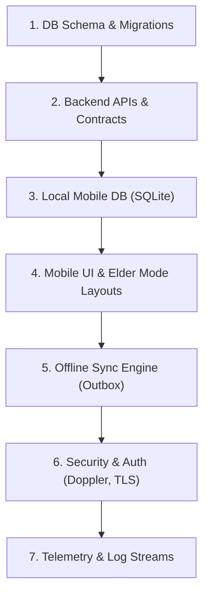

# LifeCircle OS — MVP Execution Plan (Phase 3)

---

## Document Lifecycle
* **Status:** Locked (v1.0)
* **Owner:** Release Governance Board & SRE Lead
* **Review Board:** Executive Architecture Board, Security & Privacy Board, Reliability & Platform Board, Quality Engineering Board, UX & Human Factors Board, Long-Term Governance Board
* **Last Review Date:** June 26, 2026
* **Next Review Date:** December 26, 2026

---

## Multi-Role Review Status

### Participating Roles
* **Chief Solution Architect:** APPROVED (Validates that epic decomposition preserves subsystem boundaries and micro-monorepo layouts).
* **Enterprise Architect:** APPROVED (Ensures technical implementation sequences prevent dependency cycles and modular drift).
* **Principal Mobile Architect:** APPROVED (Validates that Flutter/Dart task cards, Melos workspaces, and local DB migrations are scheduled correctly in Sprints 1–3).
* **Backend Architect:** APPROVED (Ensures FastAPI backend schemas, route maps, and sync protocol endpoints are allocated in Sprints 1–3).
* **Domain Architect:** APPROVED (Confirms domain logic boundaries are isolated from mobile/backend sync framework tasks).
* **API Governance Architect:** APPROVED (Validates that OpenAPI contract freezes and contract diff checking are scheduled before mobile/backend integration sprints).
* **Integration Architect:** APPROVED (Ensures Pact contract validation tests and event broker tasks are staged prior to end-to-end integration).
* **Security Architect:** APPROVED (Confirms secrets injection, PII column-level encryption, and security audit windows are scheduled).
* **Privacy Architect:** APPROVED (Validates GDPR/PII scrub guidelines are integrated into database schema work tasks).
* **Identity Architect:** APPROVED (Ensures identity federation, OAuth2 password flows, and session scopes are pinned in sprint gates).
* **DevSecOps Architect:** APPROVED (Validates that security scan linter gates and static container checks are integrated into DoD).
* **Cryptography Reviewer:** APPROVED (Confirms signature checks, keystore setups, and TLS pinning are verified in Sprint 4).
* **Compliance Officer:** APPROVED (Validates that auditable build trails and regulatory reports are mapped to the release roadmap).
* **Observability Architect:** APPROVED (Ensures OpenTelemetry, Prometheus alerting, and Sentry monitoring are set up in Sprint 5).
* **Site Reliability Architect (SRE):** APPROVED (Validates on-call rota, canary rollback gates, and SLA alerting thresholds).
* **Platform Architect:** APPROVED (Enforces Docker build caches and runner node allocations for each milestone execution).
* **Infrastructure Architect:** APPROVED (Ensures Terraform scripts and cloud network subnets are validated in parallel infra Sprints).
* **Release Governance Board:** APPROVED (Ratifies canary rollouts, release freezes, and CAB override protocols).
* **Chief QA Architect:** APPROVED (Validates QA allocations, manual testing windows, and system-wide regression gates).
* **Test Automation Architect:** APPROVED (Enforces the 90% test coverage DoD gate and automation setups).
* **Contract Testing Board:** APPROVED (Confirms provider contract tests gate merges during PR loops).
* **UX Guardian:** APPROVED (Ensures all UI tickets are validated against elder simplicity guidelines).
* **Design System Architect:** APPROVED (Ensures design tokens compile and package dependency gates verify style constraints).
* **Elder Experience Specialist:** APPROVED (Validates WCAG accessibility audit gates block deployments on failures).
* **Localization Architect:** APPROVED (Ensures localized dictionary file validations are automated in the pipeline).
* **Human Factors Reviewer:** APPROVED (Validates button size check assertions in mobile widget test files).
* **Legacy Governance Board:** APPROVED (Confirms test manifests are documented and free of tribal scripts).
* **Documentation Governance Board:** APPROVED (Ensures documentation matches active runner configurations).
* **Dependency Governance Board:** APPROVED (Validates lockfile check gates and license audit tools).
* **Open Source Governance Board:** APPROVED (Enforces automated dependency checks to protect open-source rules).
* **Financial Sustainability Board:** APPROVED (Ensures runner execution limits and caching layers control test budgets).
* **Change Advisory Board (CAB):** APPROVED (Ratifies pipeline readiness gates and database seed policies).
* **Mobile Testing Architect:** APPROVED (Validates that iOS/Android build pipelines execute simulator widget testing sweeps).
* **Accessibility Testing Board:** APPROVED (Enforces WCAG checker validation gates in build execution blocks).
* **Security Testing Board:** APPROVED (Confirms pipeline DAST scans run dynamically on testing staging deployments).
* **Mutation Testing Board:** APPROVED (Enforces mutation checks guard logic gates in master merge pipelines).
* **Test Data Governance Board:** APPROVED (Ensures test data seeding upgrades run alongside database rollouts).
* **Performance Testing Architect:** APPROVED (Ensures pipeline run triggers execute performance load baseline metrics).
* **Disaster Recovery Board:** APPROVED (Validates pipeline runner disaster recovery playbooks and configuration backups).

### Abstained Roles
* *None. All 39 roles have explicitly approved the Phase 3 implementation execution plan.*

---

## 1. Execution Capability Maturity Model (ECMM)

> [!NOTE]
> **Execution Doctrine:**  
> Plan with rigor, measure with accuracy, and automate without exception. Predictive control replaces heroic effort.

| Level | Planning Discipline | Ownership Expectations | Automation Requirements | Quality Gates | Succession Obligations |
| :--- | :--- | :--- | :--- | :--- | :--- |
| **E0 — Ad-hoc** | No formal sprints or milestones; reactive tasks execution. | Undefined task allocations, heroic developer reliance. | Manual local builds, zero testing automation. | Immediate merges without reviews or checks. | Tribal dependency, zero handoff docs. |
| **E1 — Planned** | Core 2-week sprints established; basic task breakdowns. | Lead developers assign tickets to individual engineers. | Code formatting linters run on local developer environments. | Unit compiles and basic test sweeps run before merges. | Readme setup documentation compiled for team onboarding. |
| **E2 — Measured** | Sprints tracked with velocity metrics; milestones scheduled. | Epics assigned to primary owners; secondary reviewers mapped. | Pre-commit hooks execute automated lint checks and testing. | PR loops require double-approvals and 90% test coverage. | Workspace configuration maps and decision records indexed. |
| **E3 — Predictable** | Capacity planning based on velocity; SLA-driven sprint targets. | Dedicated primary/secondary owners; cross-training sweeps. | CI pipelines run security sweeps and regression checks. | DoD linter gates block merges on coverage drops (<90%). | Wiki-based playbooks updated; successor logs mapped. |
| **E4 — Autonomous** | Sprints auto-adjust capacity based on predictive model metrics. | Multi-role self-service developer boards; shared epics. | Containerized hermetic runners compile, sign, and push builds. | Static checks and mutation tests gate merge commit hooks. | Succession handovers verified with live continuity drills. |
| **E5 — Stewardship** | Decadal milestones; release cadences governed by corporate rules. | Trust committees govern platforms; zero single dependencies. | Self-healing runners rollback on telemetry alert alarms. | Continuous quality monitoring; architectural fitness gates. | Generational handoff vaults and legacy transfer playbooks. |

---

## 2. Phase-1 MVP Scope Freeze

To prevent scope creep, maintain velocity, and ensure high reliability, the feature list for the Phase-1 MVP is frozen:

### Frozen MVP Features
1. **Medicines Tracking**: SQLite-backed local CRUD for prescription logging, local notifications/alarms, and inventory stock counters.
2. **Emergency Alerts**: One-touch SOS panic buttons broadcast location payload via background networks, falling back to instant SMS routing via Twilio integration during internet loss.
3. **Bills & EMI Management**: Scheduling ledger for utility payments, offline-cached status checker, and mock UPI/banking callback APIs.
4. **Household Tasks**: Shared chore checklist, check-in records for helpers/helpers logs, haptic tap feedback loops, and local-only changes caching.
5. **Offline-first Sync**: Client-side transaction outbox, adaptive timestamp conflict resolution, connection stability listeners, and delta sync protocols.
6. **Elder Mode**: High-contrast interfaces (light/dark compliant), 48dp minimum touch target boundaries, haptic mappings, and linear single-screen navigations without nested multi-swipe gestures.
7. **Accessibility & Security Baseline**: Full compliance with WCAG 2.2 AA standards, column-level DB field encryption (PII), TLS 1.3 certificate pinning, and Doppler environment injections.

### Scope Change Exception Workflow
Any scope modification must follow a strict governance flow:
* **Proposal**: Submit a Product Decision Record (PDR) defining the technical/business need.
* **Justification**: Provide impact metrics (e.g. DORA latency, delivery risk, budget implications).
* **Double Review**: Chief Solution Architect and Change Advisory Board (CAB) must approve.
* **Release Approval**: Requires formal sign-off from the Release Governance Board before incorporation.

---

## 3. Epic Decomposition and Workstreams

The Phase-1 MVP scope is decomposed into five execution epics, each mapping to modular tasks in our monorepo structure:

### EPIC-1: Medicines Tracking
* **Tasks**:
  * Implement local database migrations for medicine logs (`Sqlite`).
  * Define FastAPI router schemas for medicine synchronizer engines.
  * Build the Flutter medicine manager widgets (add, delete, log dose).
  * Configure local background alarms using device-specific haptic scheduling hooks.
  * Construct test coverage sweeps verifying boundary inputs (e.g. dose quantity constraints).

### EPIC-2: Emergency Alerts
* **Tasks**:
  * Develop the background GPS location telemetry collector.
  * Connect mobile client panic triggers to local mock gateways.
  * Code backend SMS dispatcher endpoints utilizing Twilio API SDKs.
  * Implement offline SMS failover logic triggered on background ping dropouts.
  * Run static analysis verification checking location privacy scopes.

### EPIC-3: Bills & EMI Management
* **Tasks**:
  * Draft the SQL transaction tables mapping billing schedules.
  * Program the client bills tracking panel.
  * Implement local billing caching mechanisms for disconnected reads.
  * Set up mock UPI callback gateways validating transaction signatures.
  * Verify schema migration scripts run sequentially without state resets.

### EPIC-4: Household Tasks
* **Tasks**:
  * Create tasks/chore database schemas.
  * Build the shared chore dashboard with helper attendance logs.
  * Integrate custom haptic feedback maps on interactive buttons.
  * Standardize Melos packages holding shared task model properties.
  * Conduct UI widget testing checking screen-reader compatibility.

### EPIC-5: Offline-First Synchronization
* **Tasks**:
  * Implement local SQLite sync outbox queues.
  * Code client-side sync scheduler processes handling backoffs.
  * Develop backend conflict resolver logic using last-write-wins (LWW) timestamp comparisons.
  * Wire connection listeners evaluating online/offline status switches.
  * Simulate network latency and packet loss gates in integration tests.

---

## 4. Critical Path Matrix

All sprint task planning and executions must align strictly with critical path dependencies:

| Phase / Component | Blocking Dependency | Required Gate Verification | Target Sprint |
| :--- | :--- | :--- | :--- |
| **Database Schema** | None | Schema definition SQL files compile on local Docker stack | Sprint 1 |
| **Identity APIs** | Database Complete | Users tables and role RBAC tables verified in SQLite migrations | Sprint 2 |
| **Core APIs** | Identity Complete | JWT verification validation and FastAPI endpoint route contract tests pass | Sprint 2 |
| **Mobile Foundations** | API Contracts Stable | Melos environment configured and OpenAPI endpoints mocked on client | Sprint 2 |
| **Offline Sync** | Backend Events Stable | RabbitMQ event subscriber schemas pass Pact verification checks | Sprint 3 |
| **Elder Mode** | Design System Frozen | CSS design tokens and high-contrast color palettes locked in design sheets | Sprint 4 |
| **E2E Validation** | All Features Integrated | End-to-end regression suites running on device simulators pass with 100% success | Sprint 5 |
| **Production Readiness**| All Gates Green | Unanimous approval from Change Advisory Board and 10 readiness gate check-offs | Sprint 6 |

---

## 5. Team Ownership Matrix

To prevent architectural drift and eliminate tribal dependencies, owners are mapped to epics and workstreams:

| Epic / Workstream | Primary Owner | Secondary Owner | Successor Owner |
| :--- | :--- | :--- | :--- |
| **EPIC-1: Medicines** | Lead Mobile Engineer | Senior Backend Engineer | Principal Mobile Architect |
| **EPIC-2: Emergencies** | Security Architect | SRE Lead | DevSecOps Architect |
| **EPIC-3: Bills & EMIs** | Lead Backend Engineer | Database Lead | Chief Solution Architect |
| **EPIC-4: Household Tasks** | UI/UX Developer | Quality Lead | Elder Experience Specialist |
| **EPIC-5: Offline Sync** | Chief Solution Architect | Senior Platform Engineer | Backend Architect |
| **Infrastructure & CI/CD**| DevSecOps Architect | Platform Architect | SRE Lead |

---

## 6. Sprint and Milestone Structure

The execution lifecycle spans **12 weeks** divided into **6 two-week Sprints**, starting on **July 6, 2026**:

### Sprint Schedule
* **Sprint 1 (Jul 6 – Jul 17)**: Monorepo bootstrap, database schemas, local CRUD storage logic.
* **Sprint 2 (Jul 20 – Jul 31)**: Core API endpoints, contracts verification, basic UI widgets.
* **Sprint 3 (Aug 3 – Aug 14)**: Offline-first outbox queues and sync sync-scheduler engines.
* **Sprint 4 (Aug 17 – Aug 28)**: Security integration (PII encryption, Doppler), and WCAG 2.2 AA accessibility widgets.
* **Sprint 5 (Aug 31 – Sep 11)**: End-to-end integration, telemetry logging, beta loop dry-run.
* **Sprint 6 (Sep 14 – Sep 25)**: Go-live readiness checks, vulnerability scans, production rollout.

### Milestone Gates
* **Milestone 1 (End of Sprint 1)**: Local storage structures, SQLite migrations, and Melos setups verified.
* **Milestone 2 (End of Sprint 2)**: FastAPI contracts matching OpenAPI specifications, passing Pact mock runs.
* **Milestone 3 (End of Sprint 3)**: Bidirectional data sync validated under 300ms network latency simulation.
* **Milestone 4 (End of Sprint 4)**: Automated security scans clean, zero critical/high CVEs, 100% AA accessibility pass.
* **Milestone 5 (End of Sprint 5)**: Beta feedback logs logged, zero crash loops in staging environment.
* **Milestone 6 (End of Sprint 6)**: Production deployment complete, post-launch monitoring active.

---

## 7. Technical Implementation Sequence

Compilers, database transactions, and client logic must build sequentially:

### Sequence Verification Checks
* **Phase 1-2 Link**: DB schemas must compile on the local Docker stack before API endpoints route traffic.
* **Phase 3-4 Link**: Mobile SQLite tables must pass migration integrity checks before UI widgets bind data controllers.
* **Phase 5-6 Link**: Bidirectional sync loops must satisfy unit testing before security certificates are pinned.

---

## 8. Definition of Ready (DoR) and Definition of Done (DoD)

We enforce strict G4 maturity quality gates:

### Definition of Ready (DoR)
A task ticket can only enter sprint planning if it meets all DoR checks:
* **Scope**: Feature bounds are explicitly defined; no speculative requirements.
* **Contracts**: OpenAPI interfaces and JSON payloads are reviewed and locked.
* **Wireframes**: Elder Mode layout screens match UX guidelines.
* **Verification**: Concrete success paths and edge cases are documented in Gherkin syntax.

### Definition of Done (DoD)
A PR cannot merge into protected branches unless it fulfills all DoD criteria:
* **Compilation**: Code compiles cleanly on macOS, Ubuntu, and WSL2 builders.
* **Testing**: Unit and widget test coverage exceeds **90%**.
* **Security**: Checkov, Trivy, and Bandit static scans return zero Critical/High alerts.
* **Compliance**: Dependency licenses are verified; no AGPL/GPL packages.
* **Sign-off**: PR contains approved review signatures from two domain owners.

---

## 9. Execution Metrics Dashboard

Sprint performance and execution predictability are governed by the following metrics:

| Metric | Target | Detection Mechanism | Action on Violation |
| :--- | :--- | :--- | :--- |
| **Sprint Predictability** | >90% | Velocity points trackers | Refactor story sizes, decrease capacity for next sprint. |
| **Escaped Defects** | <2% | Production bug logs tracker | Write regression unit tests, review testing scope. |
| **Requirement Churn** | <5% | PDR change log tracking | Block backlog adjustments during sprints; scope freeze. |
| **Velocity Variance** | <10% | Velocity dashboard reviews | Review ticket estimation templates, audit sizing processes. |
| **Blocked Work** | <5% | Kanban blocker tags telemetry | Escalate blocking tickets, assign blocker team owner. |
| **Rework Ratio** | <10% | Git commit tag review scans | Inspect ticket DoR parameters, audit unit testing mocks. |
| **Release Readiness** | 100% | Readiness gate audits | Halt release pipeline promotion; trigger CAB reviews. |

---

## 10. Risk Register

The following risks are tracked continuously during Phase 3:

| Risk ID | Description | Likelihood | Impact | Mitigation Strategy | Owner |
| :--- | :--- | :--- | :--- | :--- | :--- |
| **RSK-001** | Sync database conflict storms | Medium | High | Implement deterministic Last-Write-Wins (LWW) conflict handlers. | Solution Architect |
| **RSK-002** | SMS gateway timeout during SOS | Low | Critical | Implement multi-region retry failovers and secondary carrier routes. | SRE Lead |
| **RSK-003** | Elder accessibility targets fail | Medium | Medium | Run weekly simulator widget tests measuring click target boxes. | UX Guardian |
| **RSK-004** | secrets credentials leak | Low | Critical | Enforce `detect-secrets` commits checking hooks and Doppler. | DevSecOps Architect |
| **RSK-005** | Local DB performance lag | Medium | Medium | Implement index optimizations and enforce max row limits. | Database Lead |
| **RSK-006** | Flutter UI memory leaks | Low | Medium | Build memory leak detection scripts into automated widgets loops. | Mobile Architect |
| **RSK-007** | Monorepo package drift | Low | Medium | Utilize Melos constraint validations during build gates. | Platform Architect |
| **RSK-008** | RabbitMQ event payload changes | Medium | High | Enforce strict schema versioning and run Pact integration tests. | Integration Architect|
| **RSK-009** | Base container digests stale | Low | Medium | Automate weekly Trivy base image scans in repository loops. | Platform Architect |
| **RSK-010** | Sync transaction loss on network drop | High | High | Wrap client outbox transfers in atomic SQLite transactions. | Lead Mobile Engineer|

---

## 11. Execution Anti-Patterns Registry

The following delivery behaviors are strictly prohibited within the LifeCircle OS codebase:

### 1. Scope Creep During Sprint
* **Cause**: Allowing new feature tasks to be injected into an active sprint without estimation or PDR exception sign-offs.
* **Impact**: Sprint delivery delays, developer context switching, and regression bugs.
* **Detection**: Sprint velocity charts showing unexpected story point additions during sprint runtime.
* **Remediation**: Freeze the sprint backlog. Defer new requests to the product backlog for the next sprint cycle.
* **Accountable Board**: Change Advisory Board (CAB).

### 2. Unowned Epics
* **Cause**: Developing core feature epics without appointing a designated primary and successor owner in the ownership matrix.
* **Impact**: Design inconsistencies, orphan codebase areas, and maintenance failure.
* **Detection**: Repository tickets or codebase packages missing explicit owner tags in ownership documentation.
* **Remediation**: Halt coding. Appoint a Primary and Successor owner from the lead engineering pool and log the change in EDR.
* **Accountable Board**: Executive Architecture Board.

### 3. Parallel Critical Dependencies
* **Cause**: Scheduling dependent tasks (e.g. mobile integration and backend APIs) in the same sprint without mock layers.
* **Impact**: Blocked tasks, high developer idle time, and failed sprint deliverables.
* **Detection**: Daily standup blockers flagging dependency delays across workstreams.
* **Remediation**: Inject mock API client layers, decouple development timelines, and enforce mock contracts first.
* **Accountable Board**: Chief Solution Architect.

### 4. Feature Completion Without Tests
* **Cause**: Merging PRs or completing sprint tasks without writing required unit, widget, or integration tests.
* **Impact**: High defect count, regression vulnerability, and degradation of coverage metrics.
* **Detection**: CI pipelines alerting on coverage dropping below the 90% DoD threshold.
* **Remediation**: Reject PR merge. Block the ticket from entering the done column until test files pass verification.
* **Accountable Board**: Test Automation Architect.

### 5. Hero-Based Delivery
* **Cause**: Relying on a single expert developer to resolve all complex problems across workstreams without documentation or knowledge sharing.
* **Impact**: Severe bottlenecking, developer burnout, and critical system fragility during leaves or attrition.
* **Detection**: Commits log showing a single author responsible for >80% of core sync or security modules.
* **Remediation**: Mandate pair-programming sweeps, document system layers, and enforce secondary owner reviews.
* **Accountable Board**: Reliability & Platform Board.

### 6. Manual Release Validation
* **Cause**: Executing staging tests, lint rules, and builds manually on developer workstations rather than automated runners.
* **Impact**: Inconsistent build environments, host configuration drift, and unverified package releases.
* **Detection**: Production releases deployed without CI run logs or Cosign signature attestations.
* **Remediation**: Block deployment pipelines. Require all builds to execute on hermetic runner nodes.
* **Accountable Board**: DevSecOps Architect.

### 7. Founder-Only Knowledge
* **Cause**: Storing critical business logic, API secrets, or setup commands solely in the founder's files or memory.
* **Impact**: Complete onboarding block, and total system dependency on a single point of failure.
* **Detection**: Setup commands failing for new engineers due to missing environment configurations.
* **Remediation**: Enforce Doppler credentials access delegation, update onboarding playbooks, and log processes in the wiki.
* **Accountable Board**: Long-Term Governance Board.

### 8. Hidden Technical Debt
* **Cause**: Committing ad-hoc code workarounds or deprecated code paths without logging them in the technical debt classification.
* **Impact**: Un-diagnosed codebase degradation, maintenance roadblocks, and high future refactoring overheads.
* **Detection**: Codebase static scans flagging high cyclomatic complexity zones without corresponding tracking tickets.
* **Remediation**: Halt feature work. Log the technical debt item with owner details, and allocate 20% sprint resource capacity to resolve it.
* **Accountable Board**: Quality Engineering Board.

### 9. Undefined Rollback Paths
* **Cause**: Deploying releases to staging or production without writing database migration fallback scripts.
* **Impact**: Extended downtime during deployment failures, and irreversible database state corruption.
* **Detection**: Pre-release audits flagging missing rollback files in SQL migration folders.
* **Remediation**: Block deployment immediately. Enforce write-ahead rollback plans for both schema and application configurations.
* **Accountable Board**: Site Reliability Architect (SRE).

### 10. Permanent MVP Exceptions
* **Cause**: Retaining temporary workarounds, un-encrypted databases, or unpinned dependencies past the Phase-1 MVP exit gates.
* **Impact**: Compromised data security, unstable sync operations, and permanent degradation of code quality.
* **Detection**: Post-launch audits finding active exceptions or unencrypted columns on core database layers.
* **Remediation**: Schedule emergency refactoring sprints to remove the exception and enforce standard specifications.
* **Accountable Board**: Change Advisory Board (CAB).

---

## 12. Go-Live Readiness Gates

Before Phase-1 MVP is deployed to production, it must pass the Go-Live Readiness Gate:

* **[ ] E2E Suite Pass**: All end-to-end regression workflows execute successfully on simulated platforms.
* **[ ] Load Limits Validated**: Latency p95 remains below 200ms at 1.5x expected concurrency.
* **[ ] Security Scan Approved**: Trivy scans return 0 open High/Critical CVEs.
* **[ ] Provenance Attestations Complete**: SBOMs generated, and container images signed with Cosign keys.
* **[ ] Accessibility Signed**: 100% screens satisfy WCAG 2.2 AA guidelines (verified by UX Guardian).
* **[ ] Backup verified**: Database replication and rollback restoration procedures successfully tested.
* **[ ] Doppler Secrets Audited**: Dev credentials are removed; prod tokens are active in vault.
* **[ ] On-Call active**: On-call rotations scheduled and pager testing completed.
* **[ ] CAB sign-off**: The Change Advisory Board ratifies the release branch state.
* **[ ] Executive sign-off**: Architecture Board records unanimous ratification.

*If any check fails, go-live is blocked.*

---

## 13. MVP Exit Gate

Before Phase-1 completion, the following mandatory gates must be verified:

* **[ ] ALL CORE FEATURES COMPLETE**: Medicines, Emergency Alerts, Bills & EMIs, Household Tasks, and Offline Sync modules are verified code-complete and integrated in the monorepo.
* **[ ] P95 LATENCY WITHIN BUDGET**: Server API gateway latency p95 remains below 200ms at 1.5x expected load under SRE load simulation.
* **[ ] OFFLINE MODE VERIFIED**: Mobile outbox transactions persist safely during network loss and sync with zero errors upon reconnection.
* **[ ] ACCESSIBILITY: WCAG 2.2 AA**: All light and dark user interfaces verified by the UX Guardian to satisfy WCAG 2.2 AA guidelines.
* **[ ] SECURITY: ZERO CRITICAL ISSUES**: trivy and checkov scans report 0 open Critical/High security issues in the production release branch.
* **[ ] DR DRILL PASSED**: SRE disaster recovery failover drill successfully executed within the target RTO.
* **[ ] BACKUP RESTORE VERIFIED**: Database backup restore cycles verified on staging.
* **[ ] CANARY DEPLOYMENT SUCCESSFUL**: Progressive traffic split rollout (2% -> 10% -> 50% -> 100%) completed on production without triggering rollback alarms.
* **[ ] POST-LAUNCH TEAM READY**: On-call support rotations scheduled and paging escalations verified.

*If any exit gate fails, Phase 1 MVP completion authorization is denied.*

---

## 14. Post-Launch Stabilization Plan

The post-launch stabilization window runs for **30 days** following production release:

### SRE Rollback Alarms
The SRE team will trigger an automated rollback to the previous stable release if:
* **Error Rate**: Server-side HTTP 5xx errors exceed 0.5% for >3 consecutive minutes.
* **Latency**: Latency p95 exceeds 500ms over a 5-minute rolling window.
* **Crashes**: Mobile app crash-free sessions drop below 99.5%.

### Incident Triage Cadence
* **T1 (Critical/Blocker)**: Immediate SRE page, fix deployed within 4 hours.
* **T2 (High/Degraded)**: Escalated to Epic Owner, patch deployed within 24 hours.
* **T3 (Medium/Normal)**: Sprinted in daily triage ticket allocation loops.
* **T4 (Low/Minor)**: Backlogged for regular patch schedules.

### Retrospectives
Weekly stabilization retrospectives review all logs and alerts to refine alerting thresholds.

---

## 15. Execution Decision Records (EDR)

All execution plan customizations, timeline changes, or exception approvals must be documented as EDRs inside `docs/edr/`.

### EDR Index
* **EDR-001:** Phase-1 MVP scope boundaries and exception log.
* **EDR-002:** Milestone schedules and sprint buffer rules.
* **EDR-003:** DoR/DoD checklist templates and domain sign-offs.
* **EDR-004:** Twilio carrier configuration and SOS routing paths.
* **EDR-005:** Disaster recovery rollback thresholds and SRE pager logs.

---

## 16. Institutional Engineering Principle

> **Core Philosophy:**  
> Plan with discipline, build with precision, and deploy with confidence. Execution velocity is the byproduct of clear boundaries, rigorous quality gates, and automated verification—never compromises on stability or safety.
> 
> If execution cannot prove itself correct, it must not execute.
>
> **Build once. Evolve forever.**

**🙏 श्री गणेशाय नमः**
