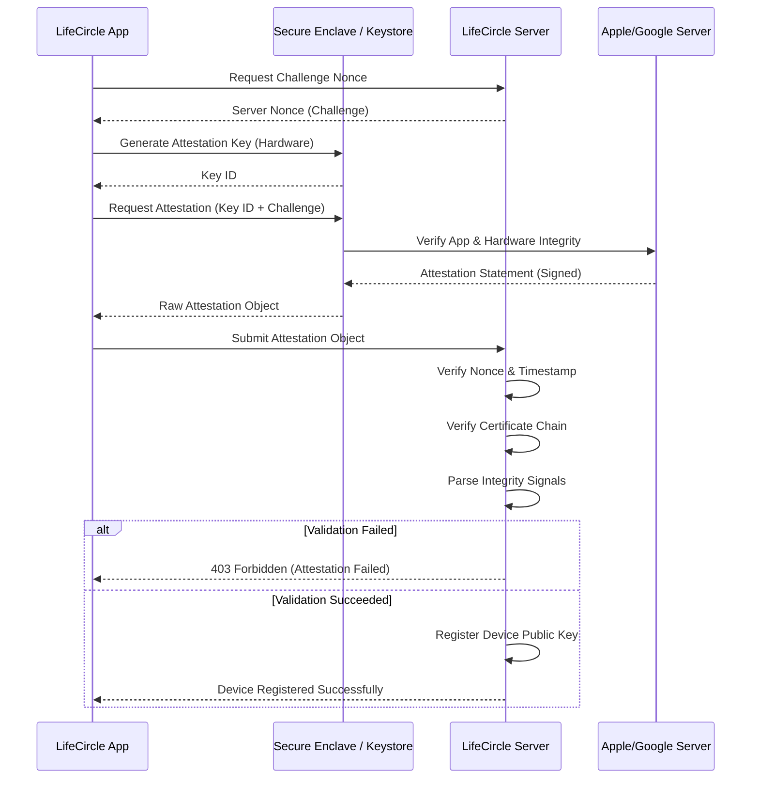

# Remote Trust Protocol

**Status:** Proposed (SEC-004C.3)
**Version:** 1.0

This protocol defines the strict cryptographic handshake required to elevate a client device from an untrusted state to a cryptographically attested state in LifeCircle OS. The server MUST NOT trust any client-reported security states unless mathematically proven by an OS-backed attestation (App Attest / Play Integrity).

## 1. The Trust Protocol Flow

## 2. API Assertions (Authenticated Requests)
Once the device is registered via the Attestation flow, all subsequent sensitive API calls MUST be cryptographically bound to the device's hardware key using Assertions.

1. Client prepares HTTP Request.
2. Client hashes the request body + headers.
3. Client uses `PlatformCryptoProvider.signPayload` with the Attestation Private Key to sign the hash.
4. Client sends Request + Signature in HTTP headers.
5. Server looks up the registered Public Key for the device.
6. Server verifies the signature against the payload. If valid, the request is cryptographically proven to originate from the uncompromised device.

## 3. Threat Model Responses
- **Replay Attacks**: Prevented by the Server Nonce (one-time use, 5-minute expiry).
- **App Cloning / Tampering**: Prevented by Apple/Google certifying the App Hash and Bundle ID in the attestation payload.
- **Key Extraction**: Prevented because the Attestation Private Key is generated directly inside the Secure Enclave / StrongBox and is marked `isExportable: false`.
- **Rooted / Jailbroken Devices**: Prevented via the OS integrity signals embedded inside the Apple/Google attestation certificates.
