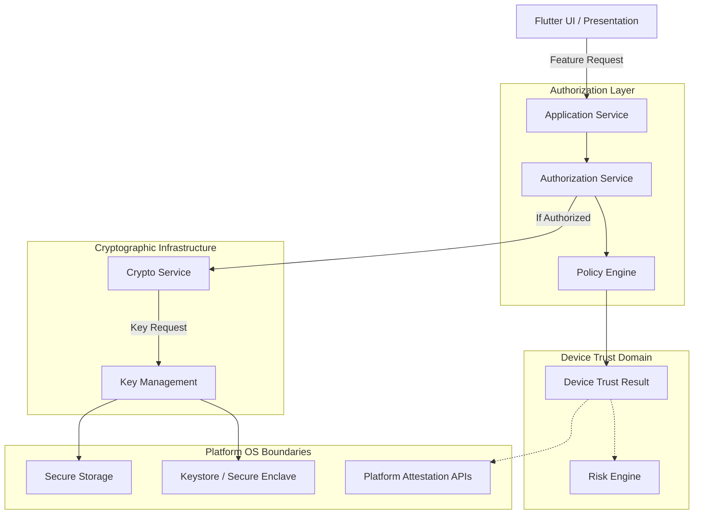

# Security Boundaries

**Status:** Proposed
**Version:** 1.0

This document defines the strict, unidirectional boundary flow for security operations within LifeCircle OS. **No layer may bypass the layer directly beneath it.**

## The Security Funnel

## Boundary Rules

### 1. The UI is Dumb
The Flutter UI (Widgets, Screens, Notifiers) must **never** evaluate authorization, device trust, or cryptographic states. It only queries Application Services and renders the results.

### 2. Authorization Funnels Everything
No Application Service (e.g., `MedicineAccessService`, `FinanceService`) may directly access the SQLite repository without first receiving an `AuthorizationDecision.allow` from the `AuthorizationService`.

### 3. Cryptography Requires Trust
The `CryptoService` will not decrypt Domain Keys or sign Sync Payloads if the `DeviceTrustResult` drops to `Restricted` or `Blocked`. Cryptographic operations explicitly consume the trust state.

### 4. Keys are Opaque
Application Services request "Encryption" or "Decryption" of a payload. They do not request raw bytes of the AES-256-GCM key. The Key Management layer retains absolute ownership of the symmetric key material.

### 5. OS APIs are Isolated
Direct invocation of `flutter_secure_storage`, `local_auth`, or iOS App Attest bindings is strictly prohibited outside of the Infrastructure layer. The rest of the platform communicates purely via Dart interfaces (`BiometricService`, `KeystoreService`).
