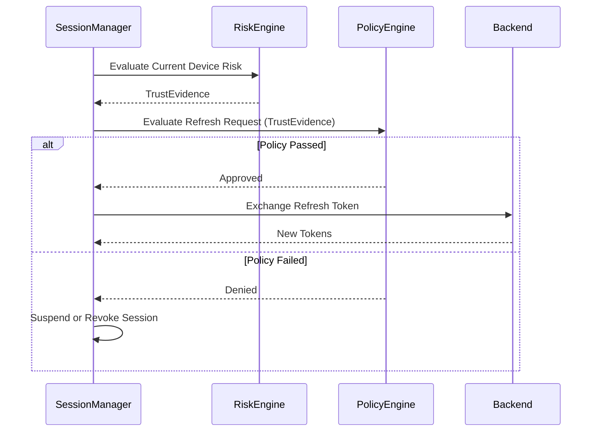

# Session Architecture (Identity Continuity)

**Status:** Proposed (SEC-005)

This document formalizes the Session Architecture for LifeCircle OS. The session layer does not merely store tokens; it establishes "Identity Continuity" by strictly binding a user's identity to their device's ongoing trust state.

## 1. Core Lifecycle Concepts
- **Short-Lived Access Tokens**: Designed to reside exclusively in memory. Lifetime: **15 minutes**.
- **Hardware-Secured Refresh Tokens**: Encrypted at rest via Keystore/Keychain. Lifetime: **30 days**.
- **Absolute Session Lifetime**: Hard limit of **90 days**. Regardless of activity, the user must re-authenticate completely at 90 days.
- **Inactivity Timeout**: Session is aggressively suspended after **7 days** of inactivity.

## 2. Session Binding Parameters
A session is never evaluated in isolation. Every session is strictly bound to cryptographic and operational evidence. If any of the following parameters mutate unexpectedly, the session MUST immediately enter the `Suspended` or `Revoked` state:
- `deviceId` (Hardware UUID)
- `attestationId` (Apple/Google attestation root)
- `trustLevel` (From Risk Engine)
- `keyId` (Hardware-backed Keystore Root)
- `familyId` (Primary Family Domain)
- `userId` (Identity Root)

## 3. Step-Up Authentication Policy
LifeCircle OS explicitly avoids repetitive login prompts for standard read/write operations. However, critical risk actions strictly mandate step-up re-authentication:
- Family ownership transfer
- Master Key / Domain KEK rotation
- Emergency delegate creation or invocation
- Recovery code export
- Payment/subscription changes

## 4. The Refresh Flow
A refresh token cannot simply "refresh itself". The refresh sequence MUST pass through the unified governance pipeline:

## 5. Token Rotation & Reuse Detection
- **Rotation**: Every time a refresh token is exchanged, a new refresh token is issued.
- **Reuse Detection**: If the backend receives an old (already exchanged) refresh token, it instantly assumes the session chain is compromised and **revokes the entire session chain**.

## 6. Immutable Audit Trail
Every lifecycle mutation MUST generate a `SessionAuditEvent` tracking `oldState`, `newState`, `reason`, `trustLevel`, and `timestamp`. This data is locally stored and asynchronously synced for forensic auditing.
