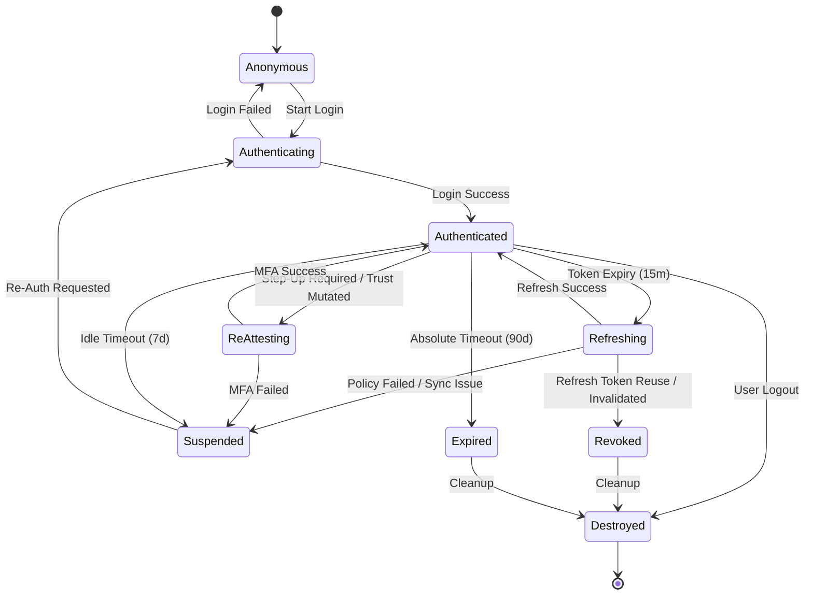

# Session State Machine

**Status:** Proposed (SEC-005B)

This document maps the strict deterministic state transitions for a LifeCircle OS session. Boolean logic (e.g., `isLoggedIn`) is strictly forbidden.

## State Machine Diagram

## Transition Matrix

| Current State | Trigger | Guard | Action | Audit Event Code | Target State |
| --- | --- | --- | --- | --- | --- |
| `Anonymous` | User Submits Login | Backend validates | Store Refresh Token, Set Mem Access Token | `SES-100` | `Authenticated` |
| `Authenticated` | Access Token Expires | `< 15m` | Request Refresh | `SES-200` | `Refreshing` |
| `Refreshing` | Refresh Token Response | `PolicyEngine` Approves | Rotate Refresh Token, Set Mem Token | `SES-201` | `Authenticated` |
| `Refreshing` | Refresh Token Reuse | Backend flags duplicate | Purge Local Secure Storage | `SES-401` | `Revoked` |
| `Authenticated` | Idle Timeout | `> 7 days` inactivity | Flush Memory, Keep Secure Storage | `SES-301` | `Suspended` |
| `Suspended` | User Re-Opens App | FaceID / PIN required | Validate Hardware Trust | `SES-302` | `Authenticating` |
| `Authenticated` | High-Risk Action | (e.g. Delegate setup) | Prompt Biometrics/PIN | `SES-202` | `ReAttesting` |
| `Authenticated` | Device Binding Mutated| `deviceId` or `trustLevel` changed | Flush Memory | `SES-403` | `Suspended` |
| `Authenticated` | User Logs Out | None | Wipe Storage, Call Backend | `SES-999` | `Destroyed` |
