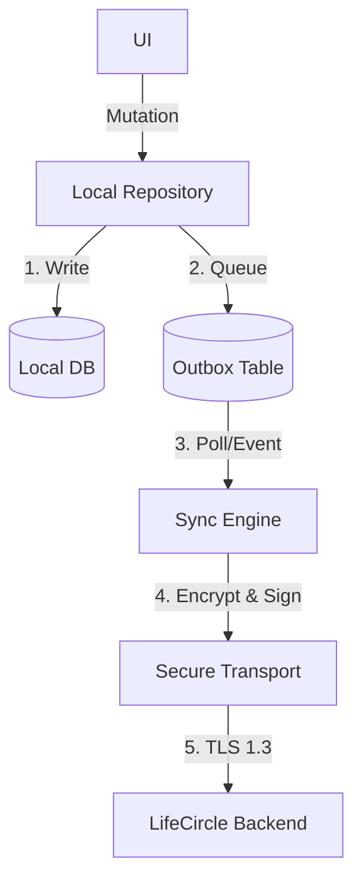

# Secure Synchronization Architecture

**Status:** Proposed (SEC-006)

This document establishes the architectural foundation for the LifeCircle OS Secure Synchronization Platform. It outlines the overarching design principles that guarantee data integrity, strict session awareness, and an offline-first resilient user experience.

## 1. Subsystem Design Principles
The synchronization layer sits above the Local Database and strictly below the UI. It never bypasses the Session Engine or the Cryptographic boundary.

### Invariants
1. **Local Writes First**: The local database is always updated instantly.
2. **UI Independence**: The UI never blocks or waits for network synchronization confirmation.
3. **Outbox Mutability**: Every data mutation is instantly enqueued into the Outbox.
4. **Cryptographic Secrecy**: Every Outbox payload is encrypted before it leaves the device.
5. **Authenticity**: Every sync batch is signed using Ed25519 (via `SigningService`).
6. **Idempotency**: Every synchronization batch can be re-run safely without causing duplicate artifacts.
7. **Explicit Conflicts**: Every conflict produces a deterministically resolvable decision (not a generic "Last Write Wins").
8. **Checkpoints**: Every completed sync updates an immutable cursor checkpoint.

## 2. Sync Topology

## 3. Exclusion of CRDTs
LifeCircle OS explicitly **does not use CRDTs** as its default architecture. CRDTs introduce significant metadata overhead and complexity suited for real-time collaborative editors. As a family operations platform, LifeCircle relies on optimistic entity versioning and explicit conflict strategies tailored to the domain.

## 4. Integration with Session Boundaries
The Sync Platform continuously relies on the `SessionStateMachine` and `PolicyEngine`. If the session transitions to `Suspended` (due to step-up auth or trust mutation), the Sync Engine immediately halts outbox processing and transitions to a paused state.
