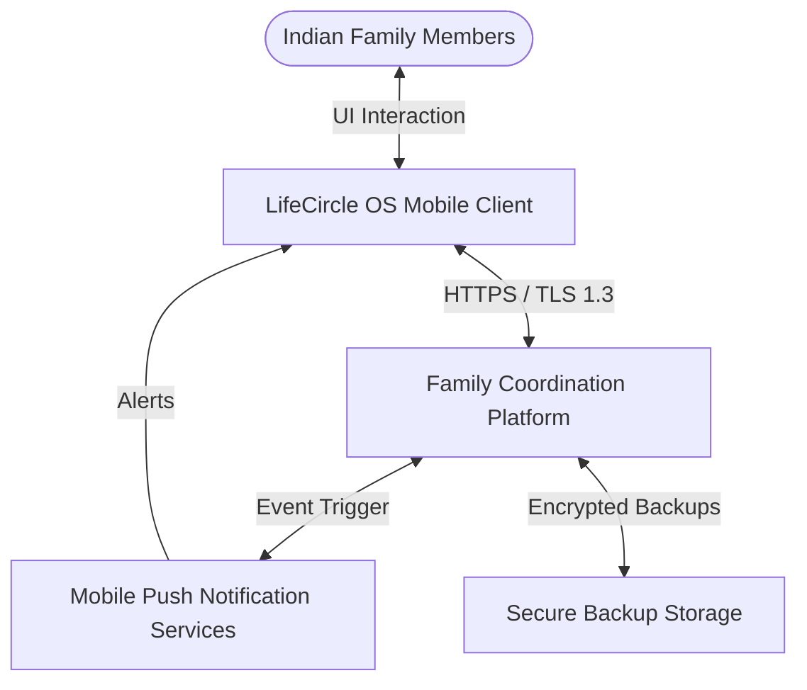
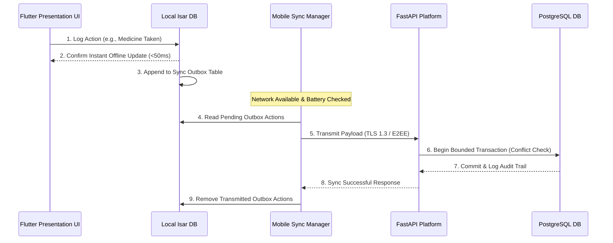

# LifeCircle OS — System Architecture

> **Status:** Locked (v1.0)  
> **Author:** Gemini (Implementation Engineer)  
> **Reviewed & Approved By:** Krishna & ChatGPT Architecture Board  
> **Date:** June 26, 2026  

---

## 1. Architecture Principles

To build a multi-generational, durable system, all architectural decisions must adhere to these foundational principles:
* **Business Capabilities are Permanent:** Core business logic survives technology transitions.
* **Technologies are Replaceable:** Databases, clients, and protocols can be swapped as ecosystems evolve.
* **Infrastructure Serves Domains:** Persistence layers and integrations conform to the domain model, not vice-versa.
* **Domains Never Serve Infrastructure:** Core entities remain independent of hardware or DB structures.
* **Frameworks are Implementation Details:** FastAPI, Flutter, or future libraries are delivery mechanisms, not architecture definitions.

---

## 2. System Context (C1 Level)

LifeCircle OS is a multi-generational Family Life Management Platform. The system consists of the mobile client, the backend platform, and peripheral notification and cloud storage infrastructure.



* **Family Members:** Aarav (Anchor), Ramesh (Elder), and Priya (Co-Pilot) interact with the application on their respective mobile devices.
* **Mobile Client:** The primary interface, built in Flutter, executing logic and queries offline-first.
* **Family Coordination Platform:** The FastAPI backend that manages multi-device synchronization, authorization, and secure database backups.
* **Push Notification Services:** Apple APNs and Google FCM to send quiet sync updates or critical medication alarms.
* **Secure Backup Storage:** Enclosed object storage for holding daily encrypted PostgreSQL snapshot files.

---

## 3. Container Architecture (C2 Level)

The core application layers are designed to isolate state, prioritize offline capabilities, and guarantee scalability.

```mermaid
graph TD
    subgraph Mobile Device
        UI[Flutter Presentation UI] <--> Controller[Riverpod Application Controller]
        Controller <--> LocalDomain[Pure Mobile Domain Model]
        Controller <--> IsarDB[(Local Encrypted Isar DB)]
        SyncManager[Offline Sync Manager] <--> IsarDB
    end

    subgraph Family Coordination Platform (Cloud)
        SyncManager <--> |TLS 1.3 / JSON| FastAPIEngine[FastAPI Engine]
        FastAPIEngine <--> RedisDB[(Redis Caching & Session Store)]
        FastAPIEngine <--> RabbitMQ[RabbitMQ Message Broker]
        FastAPIEngine <--> PostgresDB[(PostgreSQL Relational DB)]
    end
```

### Component Breakdown
* **Redis Caching & Session Store:** Handles caching, rate limiting, and short-lived sessions.
* **RabbitMQ Message Broker:** Coordinates domain events, notification queues, and background processing. RabbitMQ remains the primary event backbone of the platform.
* **PostgreSQL Relational DB:** Persistent, transactional record of family profiles, schedules, bill ledgers, and task states.

---

## 4. Service Boundaries & Bounded Contexts

### Service Layer Boundaries
We enforce strict division between layering depths:
```
Presentation Layer (UI / API Routers)
  ↓
Application Layer (Use cases & Orchestration)
  ↓
Domain Layer (Pure Business rules)
  ↓
Infrastructure Layer (Persistence & Integrations)
```
*No layer violations are permitted (e.g., domain rules importing infrastructure databases).*

### Bounded Context Map (DDD)
The system is divided into clear contexts: `Identity` (Profiles/Roles), `Medicines` (Schedules/Logs), `Finance` (Bills/EMIs/Renewals), and `Household` (Tasks/Helper attendance).
1. **Schema Isolation:** The PostgreSQL database utilizes schema prefixing or independent database instances for each context (`identity.`, `medicines.`, `finance.`, `household.`). Joint database operations across contexts are strictly prohibited.
2. **Integration Pattern:** Contexts communicate exclusively via RabbitMQ domain event infrastructure. Redis shall never become the primary event backbone.
3. **Core Independence:** Core domains contain no direct dependencies on `Identity` context tables.

---

## 5. Offline Synchronization & Eventual Consistency

Synchronization is designed to prioritize reliability and battery efficiency over real-time updates.



### Conflict Resolution Protocols
* **Medicines Domain:** Uses Last-Write-Wins (LWW) semantics. All changes are logged into an audit table to preserve a history of updates.
* **Household Tasks Domain:** Enforces Optimistic Concurrency Control (OCC) using integer version flags (`version_id`). If conflicts occur, the server rejects the update, prompting the client to re-fetch and merge changes.
* **Finance Domain:** Transactions are represented as immutable event records (e.g., `"Bill Paid by Priya at 15:45"`). Financial schedules never overwrite state via LWW; they only append payment events.

---

## 6. Security, Trust Boundaries & Standards

### Security Architecture Standards
All configurations must align with standard verification frameworks:
* **Mobile Client:** Full compliance with OWASP MASVS and OWASP MASTG guidelines, and mitigation of OWASP Mobile Top 10 vulnerabilities.
* **Backend Platform:** Strict adherence to OWASP ASVS 5.0 guidelines, mitigating OWASP API Security Top 10 and OWASP Top 10 (2025) vulnerabilities.
* **Infrastructure:** CIS Benchmarks validation, Software Bill of Materials (SBOM) generation, signed build artifacts, automated secrets detection scans, and container scanning.

### Trust Boundaries
We map security boundaries across the data flow:
```
Mobile Device → API Gateway → Application Services → Message Broker (RabbitMQ) → Databases → Backup Systems
```
*Every trust boundary boundary requires: Authentication, Authorization, Validation, Encryption, and Auditing.*

---

## 7. Performance & Observability Architecture

### Performance Budgets
* **Mobile UI:** Cold Start < 2s, Critical Screens < 500ms, Animation 60 FPS minimum (120 Hz optimization on flagship hardware), Battery < 3% active usage/hour.
* **API Latency:** P95 < 300ms, P99 < 700ms.
* **Database Queries:** < 100ms.
* **Synchronization Latency:** Medicines < 5s, Bills < 10s, Tasks < 10s.

### Observability Architecture
Every request must emit structured telemetry using the following mandatory tooling:
* **Tooling Stack:** OpenTelemetry, Prometheus, Grafana, and Sentry.
* **Identifiers:** Every request/event payload must carry Correlation IDs, Trace IDs, and Audit IDs.
* **Operational Telemetry:** Structured tracking of medicine adherence rates, bill completion rates, EMI completion rates, and household task completion metrics.
* *Personal user content shall never be logged under any operational metrics.*

---

## 8. Platform Reliability & Recovery

### Reliability Patterns
Fault isolation is guaranteed through the following patterns:
* Circuit Breakers and Graceful Degradation during network failures.
* Exponential Backoff and Retry Policies for asynchronous requests.
* Idempotency Keys on all mutable API writes.
* Container Health Probes for active orchestration.
* *Failures must be isolated. One bounded context shall never bring down another.*

### Disaster Recovery & Continuity Topology
* **RTO (Recovery Time Objective):** 1 hour.
* **RPO (Recovery Point Objective):** 15 minutes.
* **Backup Strategy:** Continuous write-ahead logging (WAL) combined with hourly incremental encrypted PostgreSQL snapshots stored across geo-replicated object storage buckets.
* **Recovery Verification:** Quarterly restore drills, backup validation exercises, failover testing, and mobile offline synchronization testing are mandatory. *Unverified backups are considered failed backups.*

---

## 9. Institutional Principle

> **Core Philosophy:**  
> LifeCircle OS is an institution. Documentation is a first-class artifact. Future engineers must require no tribal knowledge to understand and maintain the system.

🙏 श्री गणेशाय नमः
